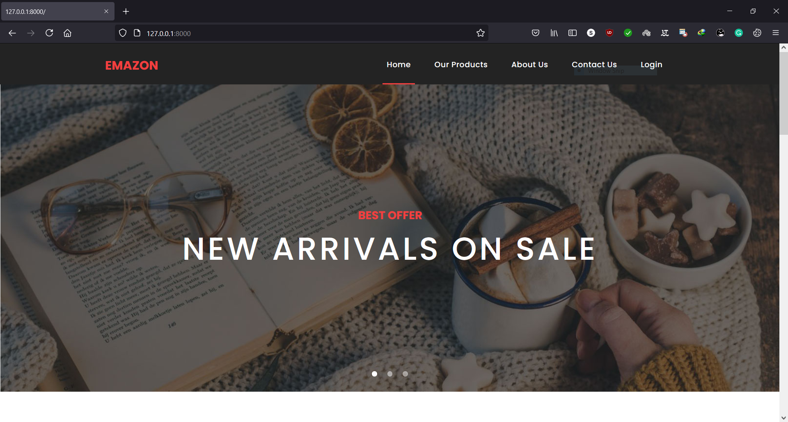

# DSI Assignment Task2 
A simple Django-based website where customers can get a different type of amazon product with a name, product image, and price in BDT. If any user clicks on the product's image to see product details or buy a product, 
it will navigate him to the Amazon website. Then the customer can buy products from amazon's website.

# Features
1. A usable link that will take the to the amazon's website.
2. The web page consists 10+ products with name, image and price in BDT.
3. If image of products is clicked, it will take the browser to the amazon's website roduct page.

# Additional Features:
1. Responsive UI
2. Framework
3. Dependency Management
4. Database (MySQL)
5. Object Relation Mapping
6. A suitable look for the use case

